```{r setup, include=FALSE}
options(htmltools.dir.version = FALSE)
knitr::opts_chunk$set(
  fig.width=9, fig.height=3.5, fig.retina=3,
  out.width = "100%",
  cache = FALSE,
  echo = TRUE,
  message = FALSE, 
  warning = FALSE,
  fig.show = TRUE,
  hiline = TRUE
)
```

```{r xaringan-themer, include=FALSE, warning=FALSE}
library(xaringanthemer)
style_duo_accent(
  primary_color = "#053061",
  secondary_color = "#053061",
  inverse_header_color = "#FFFFFF"
)
```

class: inverse center middle

# Introduction

.pull-left[
```{r ,echo=FALSE,fig.height=7}
library(ggplot2)
Year<-c(2010:2020)
Dengue<-c(25559,21079,23792,22213,34775,23010,32695,174025,51938,92467,35397)
df<-data.frame(Year,Dengue)
S1<-ggplot(df, aes(x=as.factor(Year), y=Dengue, fill=Dengue)) + 
  geom_bar(stat = "identity", color="#b2182b", fill="#b2182b")+ theme(legend.position = 'none')+
  labs(x="Year", y = "Dengue counts")
S1
```

]
.pull-right[
```{r figurechapter002, echo=FALSE, fig.align = 'center',message=FALSE,fig.height=7}
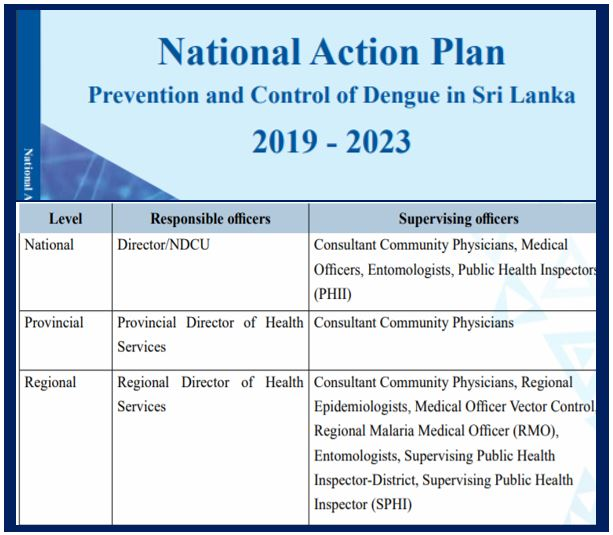
```
]

---

class: inverse center middle

```{r figurechapter02, echo=FALSE, fig.align = 'center',message=FALSE, out.width = '100%', out.height = '100%',fig.height=5, fig.width=10}
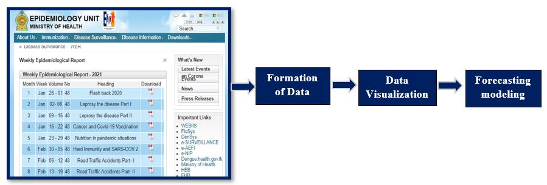
```

---

# Objectives

* Dengue incidence forecasting for districts, provinces, and whole country.

--

* Data visualization

--

* Automate the process of reading PDF files.

---

# Data

* Epidemiological unit, Ministry of Health, Sri Lanka.

  *  https://www.epid.gov.lk/web/index.php?option=com_content&view=article&id=148&Itemid=449&lang=en

* Format of the table in the Epidemiological Report

```{r figurechapter03, echo=FALSE, fig.align = 'center',message=FALSE, out.width = '100%', out.height = '40%',fig.height=5, fig.width=10}
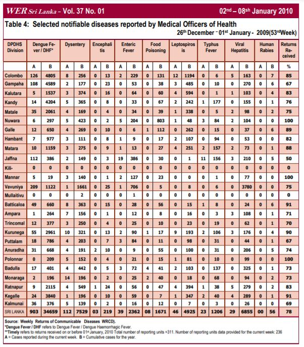
```

---

```{r ,echo=FALSE, fig.align = 'center',message=FALSE, out.width = '100%', out.height = '40%',fig.height=7, fig.width=10}
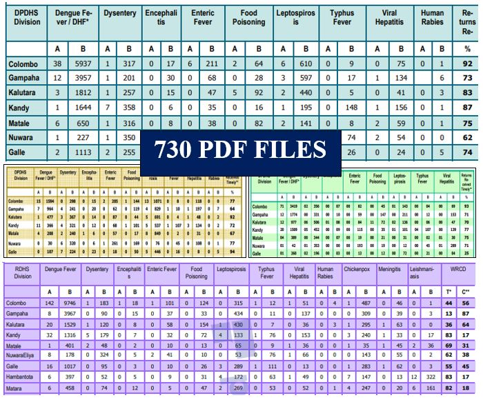
```

---

# PDF data extraction

.pull-left[
### Methods

* Copy and paste

* Manual data entry

* PDF table extraction tools
]

.pull-right[
### Challenges

* Cause errors

* Requires considerable amount of time and effort

* Doesn't maintain the original format

]

```{r , echo=FALSE, fig.align = 'center',message=FALSE}

```

---

# Reading PDF files

#### Reading_EpidemiologicalReports function

```{r }
#' path <- setwd(here::here("pdffiles","2020"))
#' startdate <- c("2019-12-21","2019-12-27","2019-12-28","2020-01-03","2020-01-04","2020-01-10","2020-01-11","2020-01-17","2020-01-18","2020-01-24","2020-01-25","2020-01-31","2020-02-01","2020-02-07","2020-02-08","2020-02-14","2020-02-15","2020-02-21","2020-02-22","2020-02-28","2020-02-29","2020-03-06","2020-03-07","2020-03-13","2020-03-14","2020-03-20","2020-03-21","2020-03-27","2020-03-28","2020-04-03","2020-04-04","2020-04-10","2020-04-11","2020-04-17","2020-04-18","2020-04-24","2020-04-25","2020-05-01","2020-05-02","2020-05-08","2020-05-09","2020-05-15","2020-05-16","2020-05-22","2020-05-23","2020-05-29","2020-05-30","2020-06-05","2020-06-06","2020-06-12","2020-06-13","2020-06-19","2020-06-20","2020-06-26","2020-06-27","2020-07-03","2020-07-04","2020-07-10","2020-07-11","2020-07-17","2020-07-18","2020-07-24","2020-07-25","2020-07-31","2020-08-01","2020-08-07","2020-08-08","2020-08-14","2020-08-15","2020-08-21","2020-08-22","2020-08-28","2020-08-29","2020-09-04","2020-09-05","2020-09-11","2020-09-12","2020-09-18","2020-09-19","2020-09-25","2020-09-26","2020-10-02","2020-10-03","2020-10-09","2020-10-10","2020-10-16","2020-10-17","2020-10-23","2020-10-24","2020-10-30","2020-10-31","2020-11-06","2020-11-07","2020-11-13","2020-11-14","2020-11-20","2020-11-21","2020-11-27","2020-11-28","2020-12-04","2020-12-05","2020-12-11","2020-12-12","2020-12-18")
#' year <- c(2019,2020,2020,2020,2020,2020,2020,2020,2020,2020,2020,2020,2020,2020,2020,2020,2020,2020,2020,2020,2020,2020,2020,2020,2020,2020,2020,2020,2020,2020,2020,2020,2020,2020,2020,2020,2020,2020,2020,2020,2020,2020,2020,2020,2020,2020,2020,2020,2020,2020,2020,2020)
#' week <- c(52,1,2,3,4,5,6,7,8,9,10,11,12,13,14,15,16,17,18,19,20,21,22,23,24,25,26,27,28,29,30,31,32,33,34,35,36,37,38,39,40,41,42,43,44,45,46,47,48,49,50,51);
#' Cname <- c("Division","Dengue","Dengue B","Dysentery","Dysentery B","Encephalitis",
#'        "Encephalitis B","Enteric Fever","Enteric Fever B","Food Poisioning",
#'        "Food Poisioning B","Leptospirosis","Leptospirosis B","Typhus Fever",
#'        "Typhus Fever B","Viral Hepatistis","Viral Hepatistis B","Human Rabies",
#'        "Human Rabies B","Chickenpox","Chickenpox B","Meningitis",
#'        "Meningitis B", "Leishmaniasis","Leishmaniasis B")
#' DeletingRows <- c(1,2,3,30,31,32,33,34)
#' TotalColmns <- 27
#' PercentageColmns <- c(26,27)
#' DeleteColmns <- c(3,5,7,9,11,13,15,17,19,21,23,25)
#' Weeks_2020 <- Reading_EpidemiologicalReports(path,startdate,year,week,Cname,DeletingRows,TotalColmns,PercentageColmns,DeleteColmns)

```

---

# Reading PDF files

```{r figurechapter07, echo=FALSE, fig.align = 'center',message=FALSE, out.width = '70%', out.height = '10%',fig.height=5, fig.width=10}
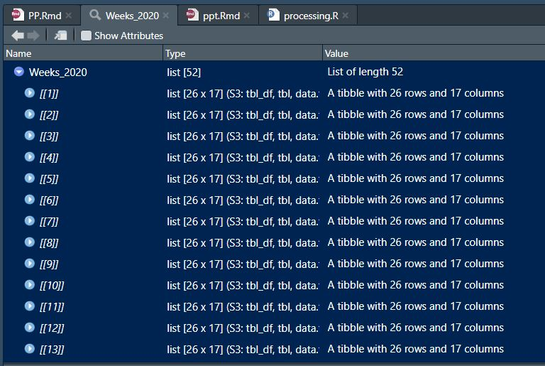
```

---

# Reading Excel files

```{r }
Processed_Data<-function(processed_data_path)
{
  Disease_Counts_csv <- list.files(path = ".", pattern = NULL, all.files = FALSE,
                                   full.names = FALSE, recursive = FALSE,
                                   ignore.case = FALSE, include.dirs = FALSE, no.. = FALSE)
  Data_Counts <- tsibble::as_tibble (data.table::rbindlist (lapply (Disease_Counts_csv , data.table::fread),fill = T))
  Data_Counts <- dplyr::relocate(Data_Counts, Year,Week,StartDate,EndDate,.before=Division)
  Data_Counts <- dplyr::arrange(Data_Counts, StartDate)
  setwd(here::here("data"))
  save (Data_Counts, file = 'FinalData.Rda')
  return(Data_Counts)
}
```

---

# DISC (DISease Counts) Package

```{r ,echo=FALSE}
library(tsibble)
library(magrittr)
library(forecast)
library(ggplot2)
library(tsibble)
library(feasts)
library(patchwork)
library(viridisLite)
library(viridis)

load("H:/ProgressPresentation/ProgressPresentation/data/FinalData.Rda")

D<-Data_Counts
D
```

---

class: inverse center middle

```{r , echo=FALSE, fig.align = 'center',message=FALSE, out.width = '100%', out.height = '100%',fig.height=5, fig.width=10,comment=NA}
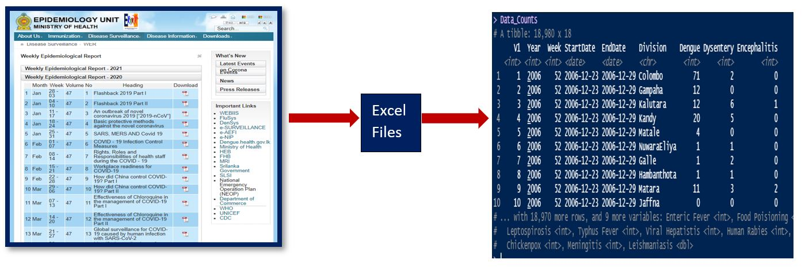
```

---

# DISC (DISease Counts) Package


```{r figurechapter08, echo=FALSE, fig.align = 'center',message=FALSE, out.width = '25%', out.height = '25%',fig.height=6, fig.width=6}
knitr::include_graphics("Figures/F8M.JPG")
```

```{r}
#install.packages("remotes")
#remotes::install_github("SMART-Research/DISC")
```

---

class: inverse center middle

```{r ,echo=FALSE}
Week<-tsibble::yearweek(D$EndDate)
Date<-D$EndDate
Province<-rep(c(rep("Western",3),rep("Central",3),rep("Southern",3),rep("Nothern",5),
                rep("Eastern",3),rep("NorthWestern",2),rep("NorthCentral",2),
                rep("Uva",2),rep("Sabaragamuwa",2),rep("Eastern",1)),730)
Districts<-D$Division
Counts<-as.integer(D$Dengue)

```


```{r ,echo=FALSE}
DengueTEST<-tibble(Week,Date,Counts,Districts,Province)
DataDengueTEST<- DengueTEST%>% 
  as_tsibble(key=c(Province,Districts),index=Week)#<<

```


```{r figurechapter09, echo=FALSE, fig.align = 'center',message=FALSE, out.width = '100%', out.height = '100%',fig.height=5, fig.width=10}
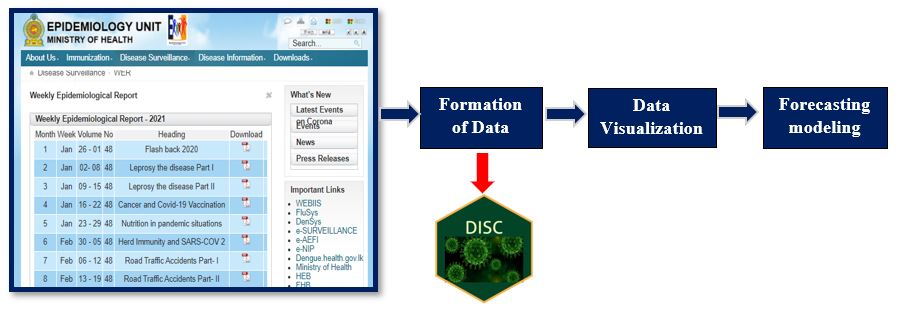
```

---

class: inverse center middle

# Data Visualization

---

# Objectives of Data Visualization

* Identify the patterns associated with time series

* Dengue outbreak identification

* Prominent features identification

---

# Data Visualization

*   Time domain visualization

*   Feature based visualization

*   Change point analysis

---
# Time domain visualization-Districts


```{r ,echo=FALSE, code=readLines("PD.R"),echo=FALSE,results='hide',message=FALSE,warning=FALSE}
```


```{r figurechapter09A, echo=FALSE, fig.align = 'center',message=FALSE, out.width = '90%', out.height = '100%',fig.height=8, fig.width=14}
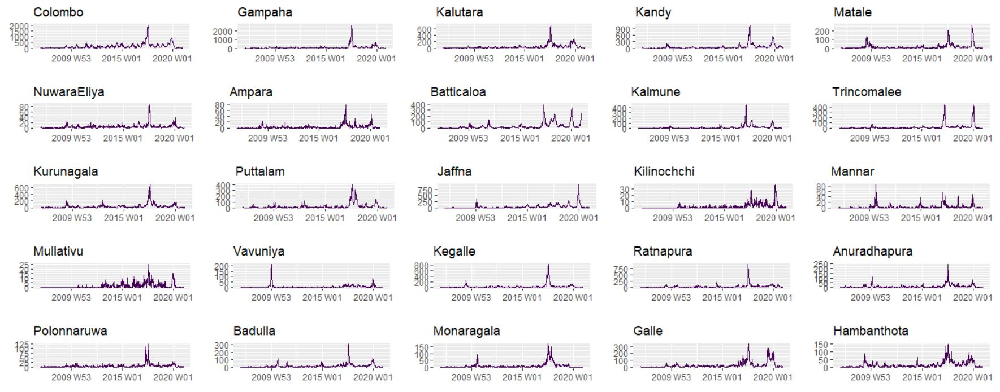
```

---
# Time domain visualization-Districts

```{r ,echo=FALSE, out.width = '90%', out.height = '40%',fig.height=5, fig.width=10, fig.align = 'center'}
Dengue_Districts <- DataDengueTEST%>%
  dplyr::group_by(Districts) %>%
  dplyr::summarise(Counts = sum(Counts))

cp<-Dengue_Districts%>%autoplot(Counts)+labs(y = "Counts",x="Week")
cp<-cp+theme(legend.position="bottom")
cp
```

---

# Time domain visualization-Districts


```{r ,echo=FALSE, out.width = '100%', out.height = '80%',fig.height=7, fig.width=14}
plotly::ggplotly(HM2)
```

---

# Min-Max Transformation

$$\frac{x_{i}-min(x)}{max(x)-min(x)}$$
where $x=(x_{1},x_{2},\dots,x_{n})$.

* Rescaling dengue counts of all districts onto 0-1 range.

---

# Time domain visualization-Districts


```{r ,echo=FALSE, out.width = '100%', out.height = '80%',fig.height=7, fig.width=14}
plotly::ggplotly(HMT2)
```

---

# Feature-based visualization

```{r figurechapter09FB, echo=FALSE, fig.align = 'center',message=FALSE, out.width = '100%', out.height = '100%',fig.height=9, fig.width=16}
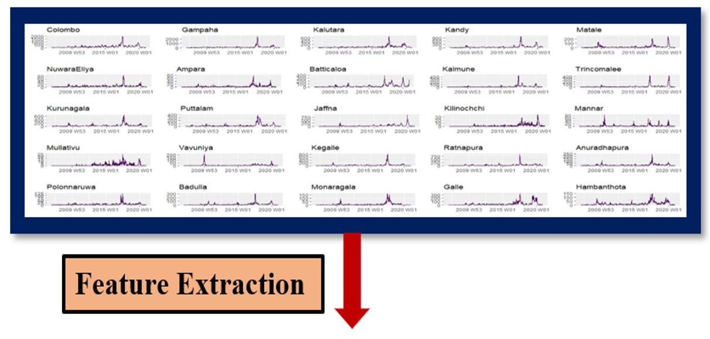
```

---

# Time series features

* Feature of a time series is the numerical summary calculated from a time series.

### Seasonal and Trend (STL) Decomposition

```{r , echo=FALSE, fig.align = 'center',message=FALSE, out.width = '70%', out.height = '70%',fig.height=5, fig.width=10}
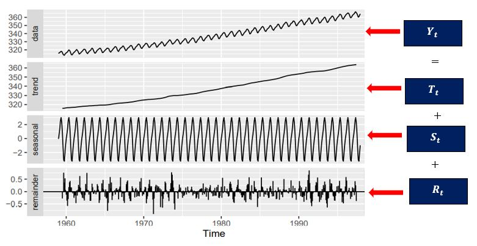
```

---

# Time series features

#### Strength of seasonality

$$F_{s}=max\biggl(0,1-\frac{Var(R_{t})}{Var(S_{t}+R_{t})}\biggr)$$
--

#### Strength of trend

$$F_{s}=max\biggl(0,1-\frac{Var(R_{t})}{Var(T_{t}+R_{t})}\biggr)$$
--

#### Spectral entropy

* A measure of forecastability of a time series.

$$H_{s}=-\int_{-\pi}^{\pi}\hat{f}_{y}(\lambda)log\hat{f}_{y}(\lambda).d\lambda$$
where $\hat{f}_{y}$ is an estimate of the spectral density of the data.

* Low value of $H_{s}$ implies that time series is easier to forecast.

---

# Time series features

#### Autocorrelation function: ACF

* Autocorrelation measures the strength of linear relationship between lagged value of a time series.

$$r_{k}=\frac{\sum_{t=k+1}^{T}(y_{t}-\bar{y})(y_{t-k}-\bar{y})}{\sum_{t=1}^{T}(y_{t}-\bar{y})^{2}}$$
$r_{k}$ measures the linear relationship between $y_{t}$ and $y_{t-k}$.

#### Number of crossing points

* computes the number of times a time series crosses the median.

---

# Spatial hierarchical structure

```{r figurechapter0004r1, echo=FALSE, fig.align = 'center',message=FALSE, out.width = '80%', out.height = '10%',fig.height=4, fig.width=10}
knitr::include_graphics("Figures/F10.JPG")
```

---

# Time series features

```{r ,echo=FALSE}
SHS_DataDengueTEST<-DataDengueTEST%>%fabletools::aggregate_key(Province/Districts,Counts=sum(Counts))
```


```{r ,echo=FALSE,comment=NA}
Dengue_features<-SHS_DataDengueTEST %>% features(Counts, feature_set(pkgs = "feasts"))
Dengue_features
```

---

# Feature-based visualization

```{r figurechapter09FB2, echo=FALSE, fig.align = 'center',message=FALSE, out.width = '20%', out.height = '5%',fig.height=9, fig.width=16}
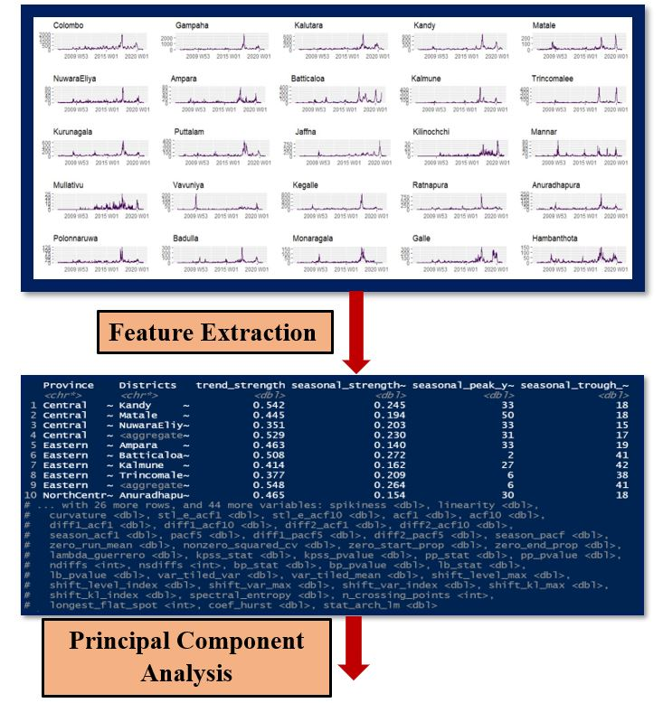
```

---

# Principal Component Analysis

* Principal components are new variables that are constructed as linear combinations of the initial variables.

--

#### Standardization

$$Z=\frac{value-mean}{s.d.}$$

--

#### Covariance matrix computation

* For a 3 dimensional data set $x, y, z$,

$$
\left[\begin{array}{ccc} 
Var(x) & Cov(x,y) & Cov(x, z)\\
Cov(y,x) & Var(y) & Cov(y, z)\\
Cov(z,x) & Cov(z,y) & Var(z)
\end{array}\right]
$$ 

--

#### Compute Eigenvalues and Eigenvectors of covariance matrix

  * Rank the Eigenvalues in in descending order $\lambda_{1}>\lambda_{2}>\lambda_{3}$
  
  * Eigenvector that corresponds to the PC1 is $v_{1}$

--

#### Obtain Principal components 

---

# Principal Component Analysis

```{r ,echo=FALSE}
library(broom)
pr<-prcomp(Dengue_features[,-c(1,2,31,33,35,37)],scale=TRUE)
data.frame(pr$rotation)
```

```{r ,echo=FALSE}
pcs<-Dengue_features%>% dplyr::select(-c(1,2,31,33,35,37)) %>% prcomp(scale = TRUE) %>%
  augment(Dengue_features)
```


---

# Feature-based visualization 

```{r ,echo=FALSE, out.width = '100%', out.height = '100%',fig.height=8, fig.width=16}
library(broom)
library(ggrepel)
A<-DataDengueTEST %>%fabletools::aggregate_key(Province/Districts,Counts=sum(Counts))
DX<-A%>% features(Counts, feature_set(pkgs = "feasts"))
DX$Districts<-c("Kandy","Matale","NuwaraEliya","Central","Ampara","Batticaloa","Kalmune","Trincomalee",
                "Eastern","Anuradhapura","Polonnaruwa","NorthCentral","Kurunagala","Puttalam",    
                "NorthWestern","Jaffna","Kilinochchi","Mannar","Mullaitivu","Vavuniya","Northern",
                "Kegalle","Ratnapura","Sabaragamuwa","Galle","Hambanthota","Matara","Southern",
                "Badulla","Monaragala","Uva","Colombo","Gampaha","Kalutara","Western","Sri Lanka")

names(DX)[1] <- 'Level'
DX$Level<-c("District","District","District","Province","District","District","District","District",
            "Province","District","District","Province","District","District",    
            "Province","District","District","District","District","District","Province",
            "District","District","Province","District","District","District","Province",
            "District","District","Province","District","District","District","Province","Country")

pcsW <- DX %>%
  dplyr::select(-c(1,2,31,33,35,37)) %>%
  prcomp(scale = TRUE) %>%
  augment(DX)


FBVZW<-pcsW %>%
  ggplot(aes(x = .fittedPC1, y = .fittedPC2, col = Level, label=Districts)) +
  geom_point() +
  theme(aspect.ratio = 1)+
  geom_text_repel(aes(label=Districts), max.overlaps = Inf)+
  labs(x="PC1", y = "PC2")

FBVZW<-FBVZW+ theme(legend.position = "bottom",legend.box = "vertical")+scale_color_manual(values = c("#e41a1c","#6a3d9a","#ff7f00"))

FBVZW1<-pcsW %>%
  ggplot(aes(x = .fittedPC1, y = .fittedPC2, col = trend_strength, label=Districts)) +
  geom_point(aes(size=trend_strength)) +
  theme(aspect.ratio = 1)+
  geom_text_repel(aes(label=Districts), max.overlaps = Inf)+
  labs(x="PC1", y = "PC2",title = "Trend strength")+scale_color_viridis(option = "A")+
  ggeasy::easy_center_title()+guides(size = FALSE)

FBVZW1<-FBVZW1+ theme(legend.position = "bottom",legend.box = "vertical")+
  labs(colour = NULL)

(FBVZW|FBVZW1)

```


---

# Feature-based visualization 

```{r ,echo=FALSE, out.width = '100%', out.height = '100%',fig.height=8, fig.width=16}

FBVZW2<-pcsW %>%
  ggplot(aes(x = .fittedPC1, y = .fittedPC2, col = seasonal_strength_year, label=Districts)) +
  geom_point(aes(size=seasonal_strength_year)) +
  theme(aspect.ratio = 1)+
  geom_text_repel(aes(label=Districts), max.overlaps = Inf)+
  labs(x="PC1", y = "PC2",title = "Seasonal strength")+scale_color_viridis(option = "A")+
  ggeasy::easy_center_title()+guides(size = FALSE)

FBVZW2<-FBVZW2+ theme(legend.position = "bottom",legend.box = "vertical")+
  labs(colour = NULL)

FBVZW3<-pcsW %>%
  ggplot(aes(x = .fittedPC1, y = .fittedPC2, col = spectral_entropy, label=Districts)) +
  geom_point(aes(size=spectral_entropy)) +
  theme(aspect.ratio = 1)+
  geom_text_repel(aes(label=Districts), max.overlaps = Inf)+
  labs(x="PC1", y = "PC2",title = "Entropy")+scale_color_viridis(option = "A")+
  ggeasy::easy_center_title()+guides(size = FALSE)

FBVZW3<-FBVZW3+ theme(legend.position = "bottom",legend.box = "vertical")+
  labs(colour = NULL)

(FBVZW2|FBVZW3)

```

---

# Feature-based visualization 

```{r ,echo=FALSE, out.width = '100%', out.height = '100%',fig.height=8, fig.width=16}

FBVZW4<-pcsW %>%
  ggplot(aes(x = .fittedPC1, y = .fittedPC2, col = acf1, label=Districts)) +
  geom_point(aes(size=acf1)) +
  theme(aspect.ratio = 1)+
  geom_text_repel(aes(label=Districts), max.overlaps = Inf)+
  labs(x="PC1", y = "PC2",title = "acf1")+scale_color_viridis(option = "A")+
  ggeasy::easy_center_title()+guides(size = FALSE)

FBVZW4<-FBVZW4+ theme(legend.position = "bottom",legend.box = "vertical")+
  labs(colour = NULL)

FBVZW5<-pcsW %>%
  ggplot(aes(x = .fittedPC1, y = .fittedPC2, col = n_crossing_points, label=Districts)) +
  geom_point(aes(size=n_crossing_points)) +
  theme(aspect.ratio = 1)+
  geom_text_repel(aes(label=Districts), max.overlaps = Inf)+
  labs(x="PC1", y = "PC2",title = "crossing_points")+scale_color_viridis(option = "A")+
  ggeasy::easy_center_title()+guides(size = FALSE)

FBVZW5<-FBVZW5+ theme(legend.position = "bottom",legend.box = "vertical")+
  labs(colour = NULL)

(FBVZW4|FBVZW5)

```

---

# Temporal hierarchical structure

```{r figurechapter0005V1, echo=FALSE, fig.align = 'center',message=FALSE, out.width = '100%', out.height = '5%',fig.height=5, fig.width=10}
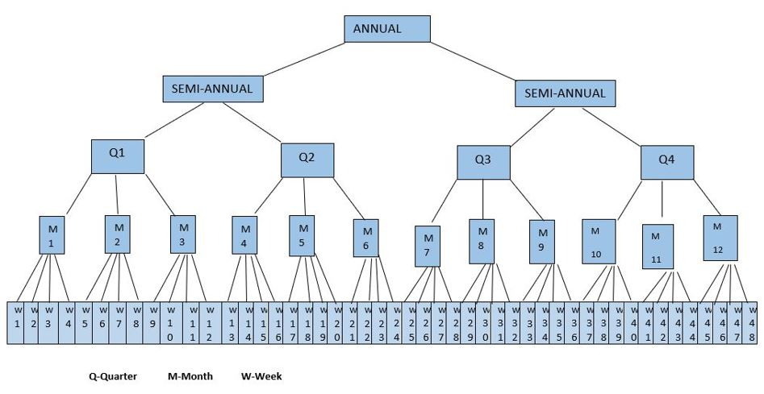
```

---

# Temporal hierarchical structure

```{r figurechapter0005V2, echo=FALSE, fig.align = 'center',message=FALSE, out.width = '100%', out.height = '80%',fig.height=7, fig.width=14}
TEM
```

---

# Temporal hierarchical time series features

```{r}
library(tsfeatures)
Temporal_DengueFeatures<-tsfeatures(aggts_total)
Temporal_DengueFeatures
```

---

# Excluded features from PCA

```{r}
Temporal_DengueFeatures[,c(1,10,11,12,20)]
```

---

```{r}
pr<-prcomp(Temporal_DengueFeatures[,-c(1,10,11,12,20)],scale=TRUE)
```

```{r ,echo=FALSE}
data.frame(pr$rotation)
```

---

# Feature-based visualization

```{r ,echo=FALSE, out.width = '100%', out.height = '100%',fig.height=8, fig.width=16}
(TEMFBV|TEMFBV1)
```

---

# Feature-based visualization

```{r ,echo=FALSE, out.width = '100%', out.height = '100%',fig.height=8, fig.width=16}
(TEMFBV2|TEMFBV3)
```

---

class: inverse center middle

```{r figurechapter09N, echo=FALSE, fig.align = 'center',message=FALSE, out.width = '100%', out.height = '100%',fig.height=5, fig.width=10}
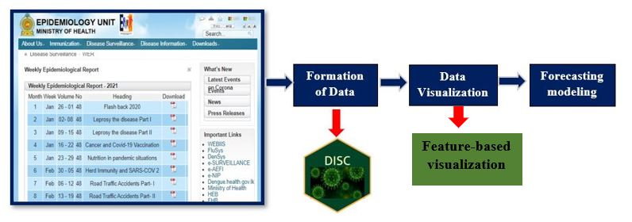
```

---

class: inverse center middle

# Forecasting modeling

---

# Spatial hierarchical structure

```{r figurechapter0004, echo=FALSE, fig.align = 'center',message=FALSE, out.width = '80%', out.height = '10%',fig.height=4, fig.width=10}
knitr::include_graphics("Figures/F10.JPG")
```

---

# Spatial hierarchical forecasting workflow

```{r ,echo=FALSE, out.width = '60%', out.height = '40%',fig.height=6, fig.width=6}
knitr::include_graphics("Figures/S1.JPG")
```

---

# Spatial hierarchical forecasting workflow

```{r ,highlight.output=c(1, 2)}
DengueTEST<-tibble(Week,Date,Counts,Districts,Province)
DengueTRAIN<-DengueTEST%>%dplyr::filter(lubridate::year(Week)<2020)
DataDengueTRAIN<-DengueTRAIN%>% 
  as_tsibble(key=c(Province,Districts),index=Week)#<<
DataDengueTRAIN
```


---

# Spatial hierarchical forecasting workflow

```{r ,echo=FALSE, out.width = '60%', out.height = '40%',fig.height=6, fig.width=6,fig.align='center'}
knitr::include_graphics("Figures/S2.JPG")
```

---

# Spatial hierarchical forecasting workflow

```{r ,highlight.output=c(1, 2)}
HS_DataDengueTRAIN<-DataDengueTRAIN%>%
          fabletools::aggregate_key(Province/Districts,Counts=sum(Counts))#<<

HS_DataDengueTRAIN
```

---

# Spatial hierarchical forecasting workflow

```{r ,echo=FALSE, out.width = '85%', out.height = '10%',fig.height=4, fig.width=10,fig.align='center'}
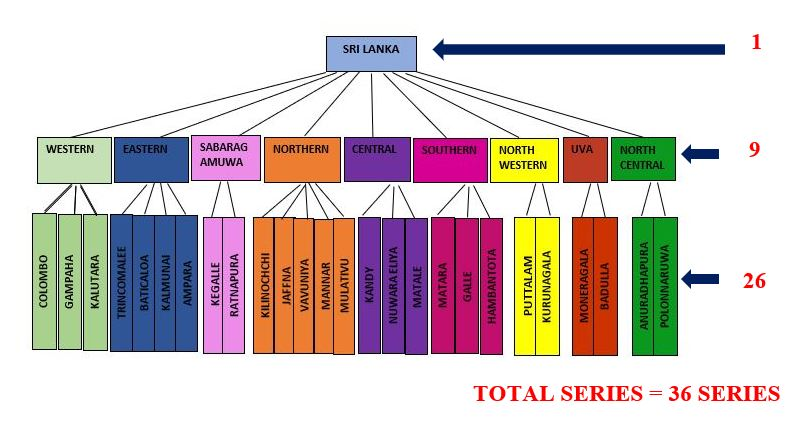
```

---

#### District level

```{r ,highlight.output=c(5,6,7)}
HS_DataDengueTRAIN%>% dplyr::filter(!is_aggregated(Districts)& !is_aggregated(Province))%>%print(n=3)
```

#### Province level

```{r ,highlight.output=c(5)}
HS_DataDengueTRAIN%>% dplyr::filter(is_aggregated(Districts)& !is_aggregated(Province))%>%print(n=3)
```

---
#### Country level

```{r}
HS_DataDengueTRAIN%>% dplyr::filter(is_aggregated(Districts)& is_aggregated(Province))%>%print(n=13)
```

---

# Spatial hierarchical forecasting workflow

```{r ,echo=FALSE, out.width = '60%', out.height = '5%',fig.height=7, fig.width=6,fig.align='center'}
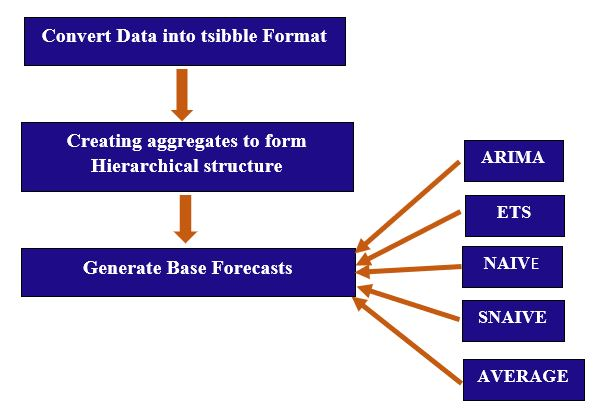
```

---

# Spatial hierarchical forecasting workflow

```{r ,echo=FALSE}
library(magrittr)
library(fabletools)
library(fable)
```

.left-column[
```{r , echo=FALSE, fig.align = 'center',message=FALSE, out.width = '80%', out.height = '80%',fig.height=4, fig.width=4}

```
]

.right-column[
```{r }
HS_DataDengueTRAIN%>%
    model(arima =ARIMA(Counts),snaive=SNAIVE(Counts),naive=NAIVE(Counts),ets=ETS(Counts),avg = MEAN(Counts))%>% forecast(h =52)%>%print(n=5)
```
]

---

# Base forecasts - SNAIVE method

```{r ,echo=FALSE,highlight.output=c(6,11,16,21)}
AGGCHECK<-HS_DataDengueTRAIN%>%
    model(arima =ARIMA(Counts),snaive=SNAIVE(Counts),naive=NAIVE(Counts),ets=ETS(Counts),avg = MEAN(Counts))%>% forecast(h =52)

AGGCHECK%>%dplyr::filter(Week==tsibble::yearweek("2020-01-03"))%>%dplyr::filter(Province=="Central")
```

---

# Base forecasts - NAIVE method

```{r ,echo=FALSE,highlight.output=c(7,12,17,22)}
AGGCHECK<-HS_DataDengueTRAIN%>%
    model(arima =ARIMA(Counts),snaive=SNAIVE(Counts),naive=NAIVE(Counts),ets=ETS(Counts),avg = MEAN(Counts))%>% forecast(h =52)

AGGCHECK%>%dplyr::filter(Week==tsibble::yearweek("2020-01-03"))%>%dplyr::filter(Province=="Central")
```

---

# Base forecasts - Average method

```{r ,echo=FALSE,highlight.output=c(9,14,19,24)}
AGGCHECK<-HS_DataDengueTRAIN%>%
    model(arima =ARIMA(Counts),snaive=SNAIVE(Counts),naive=NAIVE(Counts),ets=ETS(Counts),avg = MEAN(Counts))%>% forecast(h =52)

AGGCHECK%>%dplyr::filter(Week==tsibble::yearweek("2020-01-03"))%>%dplyr::filter(Province=="Central")
```


---

# Spatial hierarchical forecasting workflow

```{r ,echo=FALSE, out.width = '50%', out.height = '5%',fig.height=7, fig.width=6,fig.align='center'}
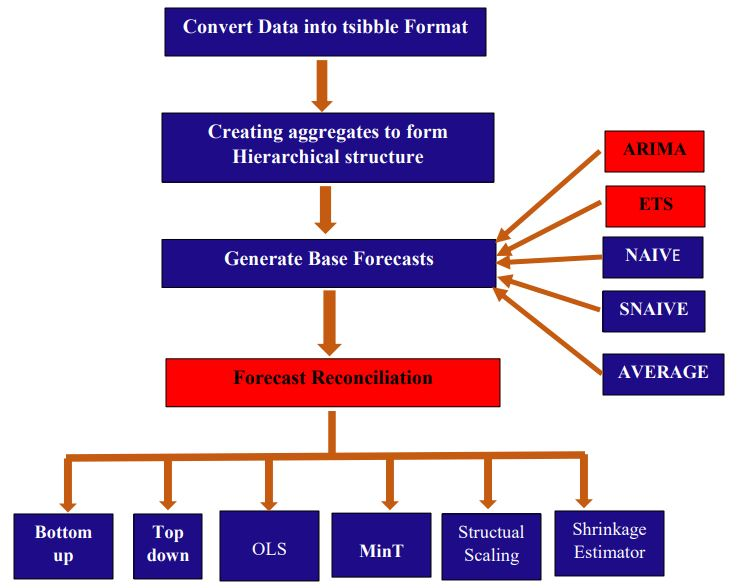
```

---

# Spatial hierarchical forecasting workflow

```{r}
fit_TRAIN <- HS_DataDengueTRAIN%>%
    model(arima =ARIMA(Counts),snaive=SNAIVE(Counts),naive=NAIVE(Counts),ets=ETS(Counts),avg =     MEAN(Counts))%>%
    fabletools::reconcile(bu_arima = bottom_up(arima),#<<
                          top_arima=top_down(arima),#<<
                          ols_arima=min_trace(arima,method="ols"),#<<
                          MinT_arima=min_trace(arima,method="mint_shrink"),#<<
                          wls_var_arima = min_trace(arima,method="wls_var"),#<<
                          wls_struct_arima=min_trace(arima,method="wls_struct"),#<<
                          MinT_cov_arima=min_trace(arima,method="mint_cov"),#<<
                          bu_ets = bottom_up(ets),#<<
                          top_ets=top_down(ets),#<<
                          ols_ets=min_trace(ets,method="ols"),#<<
                          MinT_ets=min_trace(ets,method="mint_shrink"),#<<
                          wls_var_ets = min_trace(ets,method="wls_var"),#<<
                          wls_struct_ets=min_trace(ets,method="wls_struct"),#<<
                          MinT_cov_ets=min_trace(ets,method="mint_cov"))#<<
```

---

# Spatial hierarchical forecasting workflow

```{r ,echo=FALSE, out.width = '50%', out.height = '5%',fig.height=7, fig.width=6,fig.align='center'}
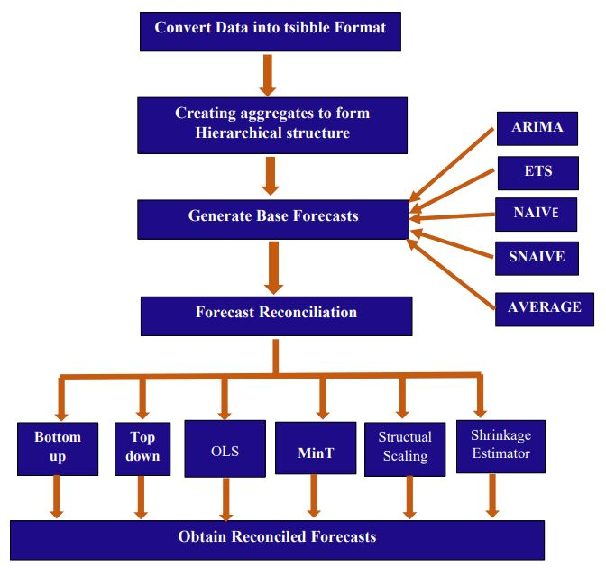
```

---

# Spatial hierarchical forecasting workflow

```{r}
fc_TRAIN <- fit_TRAIN %>% forecast(h = 52)
fc_TRAIN
```

---
## Reconciled forecasts


```{r ,echo=FALSE ,highlight.output=c(5)}
fc_TRAIN%>% dplyr::filter(is_aggregated(Districts))%>%dplyr::filter(Province=="Central")%>%dplyr::filter(.model==c("bu_arima"))%>%print(n=4)
```

```{r ,echo=FALSE ,highlight.output=c(5)}
fc_TRAIN%>%dplyr::filter(Districts=="NuwaraEliya")%>%dplyr::filter(.model==c("bu_arima"))%>%print(n=4)
```

---
## Reconciled forecasts

```{r ,echo=FALSE ,highlight.output=c(5)}
fc_TRAIN%>%dplyr::filter(Districts=="Kandy")%>%dplyr::filter(.model==c("bu_arima"))%>%print(n=4)
```

```{r ,echo=FALSE ,highlight.output=c(5)}
fc_TRAIN%>%dplyr::filter(Districts=="Matale")%>%dplyr::filter(.model==c("bu_arima"))%>%print(n=4)
```


---

# Spatial hierarchical forecasting workflow

```{r ,echo=FALSE, out.width = '47%', out.height = '5%',fig.height=7, fig.width=6,fig.align='center'}
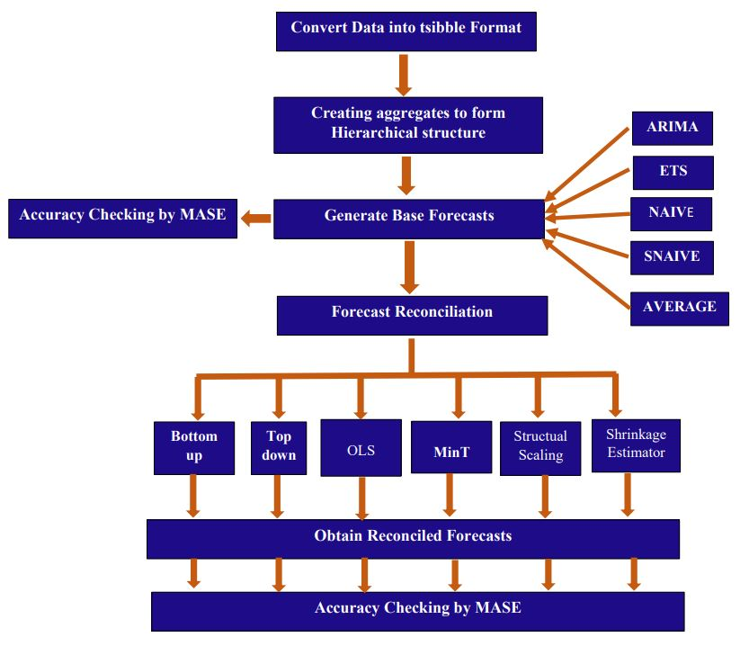
```

---

# Accuracy calculation - MASE

```{r ,echo=FALSE}
HS_DataDengueTEST<-DataDengueTEST%>%fabletools::aggregate_key(Province/Districts,Counts=sum(Counts))
```

```{r}
ac_TRAIN<-accuracy(fc_TRAIN, HS_DataDengueTEST)
ac_TRAIN_MASE<-ac_TRAIN[,c(1,2,3,10)]
ac_TRAIN_MASE
```

---

### MASE values for Training set: 2006-2019 and Test set: 2020 weekly data

```{r ,echo=FALSE, out.width = '75%', out.height = '40%',fig.height=7, fig.width=12,fig.align='center'}
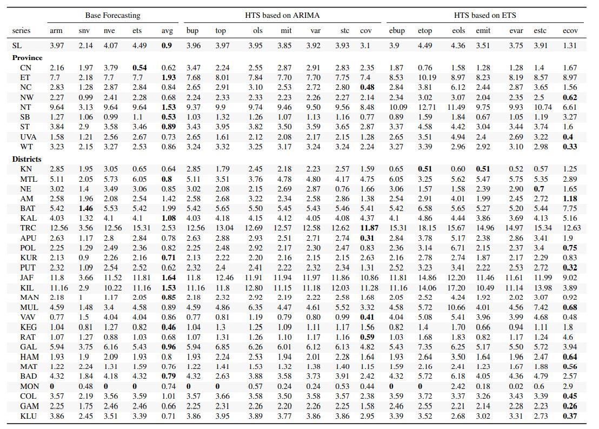
```

---

# Spatial hierarchical forecasting

```{r ,echo=FALSE, out.width = '70%', out.height = '40%',fig.height=7, fig.width=14,fig.align='center'}
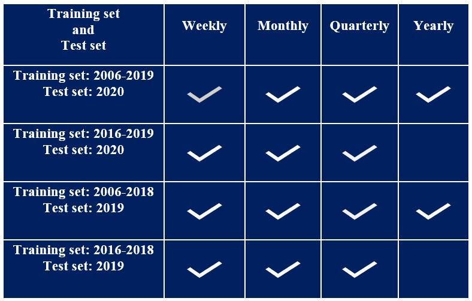
```

---

# The best forecasting approaches in districts

```{r ,echo=FALSE, out.width = '48%', out.height = '17%',fig.height=7, fig.width=14,fig.align='center'}
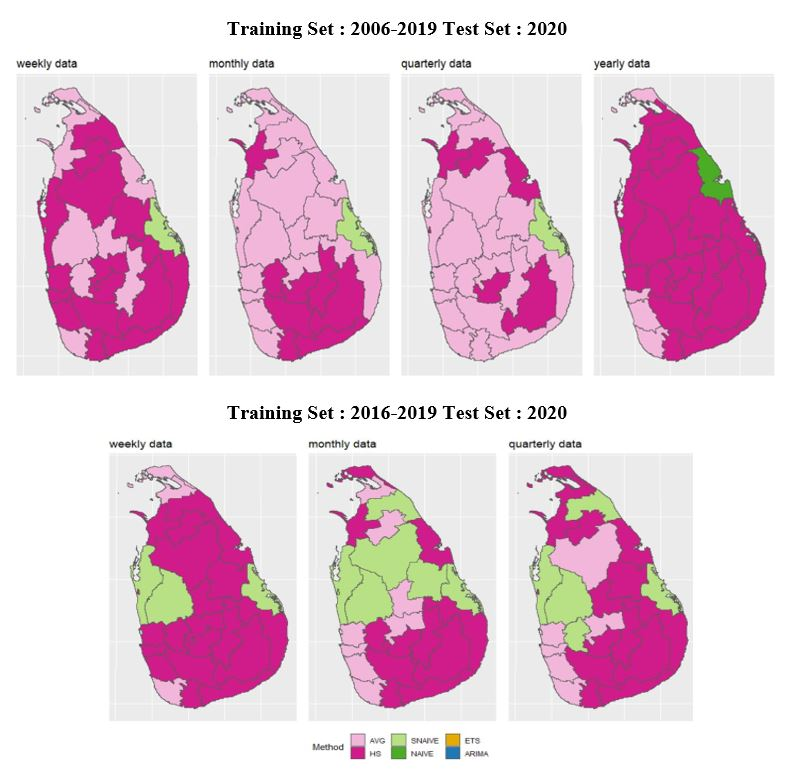
```

---

# The best forecasting approaches in provinces

```{r ,echo=FALSE, out.width = '48%', out.height = '17%',fig.height=7, fig.width=14,fig.align='center'}
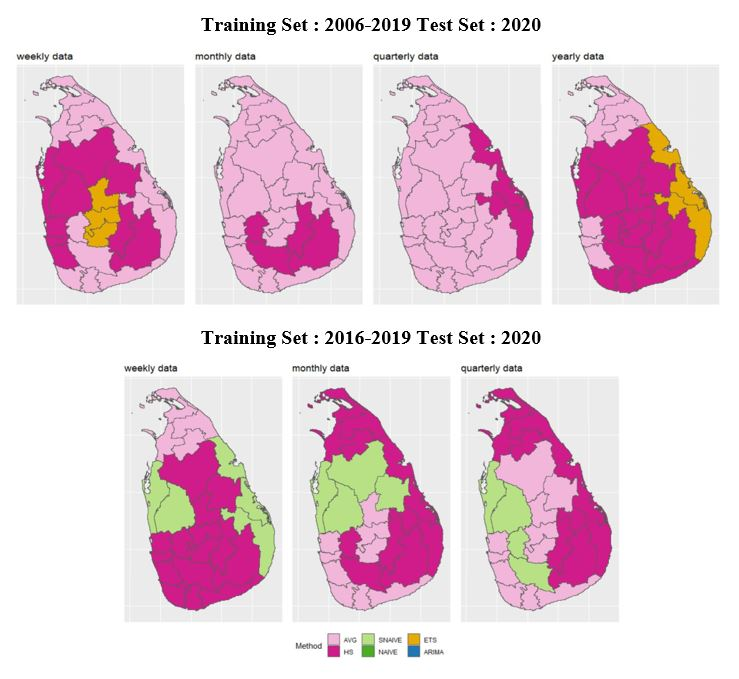
```

---

# The best approach for forecasts in 2020 

```{r ,echo=FALSE, out.width = '42%', out.height = '10%',fig.height=7, fig.width=14,fig.align='center'}
knitr::include_graphics("Figures/MAP3.JPG")
```

---

# Visualization of model performance-Weekly series

```{r ,echo=FALSE}
library(readxl)
library(broom)
Weekly_20AD<- read_excel("C:/Users/USER/Desktop/Book1.xlsx")
Weekly_20AD<-Weekly_20AD[,-c(1)]

pcsWk20AD <- Weekly_20AD %>%
  dplyr::select(-c(1,2)) %>%
  prcomp(scale = TRUE) %>%
  augment(Weekly_20AD)

Method<-c("HS","AVG","HS","ETS","HS","SNAIVE",rep("AVG",3),rep("HS",3),"AVG",rep("HS",2),
          rep("AVG",3),rep("HS",2),rep("AVG",2),rep("HS",1),rep("AVG",2),rep("HS",2),
          rep("AVG",2),rep("HS",6),rep("AVG",1),rep("HS",5),"SNAIVE",rep("HS",2),"SNAIVE",rep("HS",3),rep("SNAIVE",3),rep("AVG",2),
          rep("HS",3),rep("AVG",1),rep("HS",3),rep("AVG",1),rep("HS",10),rep("AVG",1),"SNAIVE",
          rep("HS",2),"SNAIVE","HS","AVG",rep("HS",2),rep("AVG",2),rep("HS",5),"SNAIVE","AVG",
          "HS","NAIVE","HS","SNAIVE",rep("HS",8),"NAIVE",rep("HS",6),rep("HS",15),"SNAIVE",
          "AVG",rep("NAIVE",2),"HS","SNAIVE",rep("HS",3),"AVG",rep("HS",2),"ETS",rep("HS",8))

pcsWk20AD$Level<-Method

FBVZWW1MAD<-pcsWk20AD %>%
  ggplot(aes(x = .fittedPC1, y = .fittedPC2, col = Level,label=Districts)) +
  geom_point(position=position_jitter(h=0.1, w=0.1),size=2) +
  theme(aspect.ratio = 1)+
  labs(x="PC1", y = "PC2")
FBVZWW1MAD<-FBVZWW1MAD+ theme(legend.position = "right",legend.box = "vertical")+
  labs(colour = NULL)+scale_color_manual(values = c("#e7298a","#e6ab02","#1b9e77","#762a83","#543005"))
FBVZWW1MAD

```


---

# Temporal hierarchical structure

```{r figurechapter0005, echo=FALSE, fig.align = 'center',message=FALSE, out.width = '100%', out.height = '5%',fig.height=5, fig.width=10}

```

---
# Compute all temporal aggregated time series

.left-column[
```{r , echo=FALSE, fig.align = 'center',message=FALSE, out.width = '80%', out.height = '80%',fig.height=4, fig.width=4}

```
]

.right-column[
```{r ,echo=FALSE}
D<-D%>%dplyr::filter(Week!=53)

Dengue_Disease<-D[,c(5,6,7)]
Dengue_Disease_tsbl<-Dengue_Disease%>%as_tsibble(key=Division,index=EndDate)
Weekly_Dengue<-Dengue_Disease_tsbl%>%
  tsibble::index_by(WD=~yearweek(.))%>%
  dplyr::summarise(Dengue=sum(Dengue))
Dengue_total_data<-c(Weekly_Dengue$Dengue)

```

```{r }
Dengue_total_data<- ts(Dengue_total_data, freq=52, start=c(2006,52))
Dengue_train_data<- window(Dengue_total_data , start = c(2006,52), end = c(2019,51), frequency = 52)
aggts_total = thief::tsaggregates(Dengue_total_data)#<<
aggts_train = thief::tsaggregates(Dengue_train_data)#<<
summary(aggts_total)

```
]

---
# Compute base forecasts

.left-column[
```{r , echo=FALSE, fig.align = 'center',message=FALSE, out.width = '80%', out.height = '80%',fig.height=4, fig.width=4}

```
]

.right-column[
```{r}
base <- list()
for(i in seq_along(aggts_train))
base[[i]] <- forecast(forecast::auto.arima(aggts_train[[i]]),
                          h=1*frequency(aggts_train[[i]]))
base
# forecast::ets, forecast::snaive, forecast::naive, forecast::meanf
```

]

---

# Reconcile forecasts

```{r}
reconciled <- thief::reconcilethief(base,comb = c("bu"))
# comb = c("bu","ols","struc","shr")
reconciled
```

---

# Accuracy checking 

#### Weekly series accuracy 

```{r}
accuracy(reconciled[[1]],aggts_total[[1]])[,"MASE"]
```

#### Bi-weekly series accuracy 

```{r}
accuracy(reconciled[[2]],aggts_total[[2]])[,"MASE"]
```

#### Monthly series accuracy 

```{r}
accuracy(reconciled[[3]],aggts_total[[3]])[,"MASE"]
```

---

#  The best forecasting approaches for temporal granualities

```{r ,echo=FALSE, fig.align = 'center',message=FALSE, out.width = '100%', out.height = '50%',fig.height=8, fig.width=10}
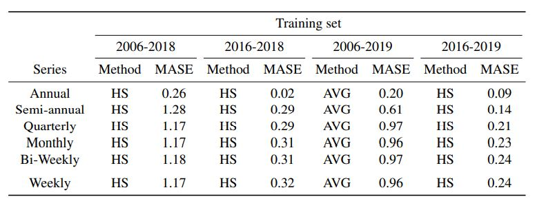
```

---
class: center, middle

# Thank you!

Slides created via the R packages:

[**xaringan**](https://github.com/yihui/xaringan)<br>
[gadenbuie/xaringanthemer](https://github.com/gadenbuie/xaringanthemer)

The chakra comes from [remark.js](https://remarkjs.com), [**knitr**](http://yihui.name/knitr), and [R Markdown](https://rmarkdown.rstudio.com).
