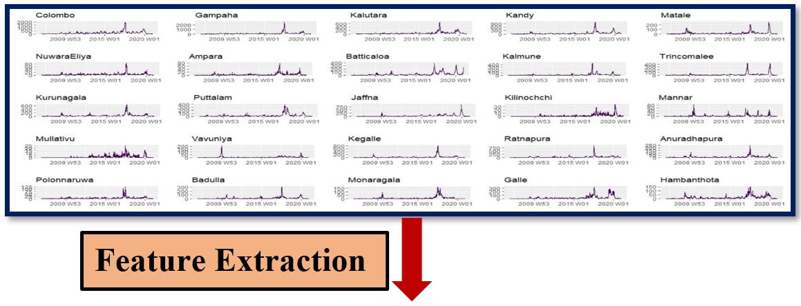
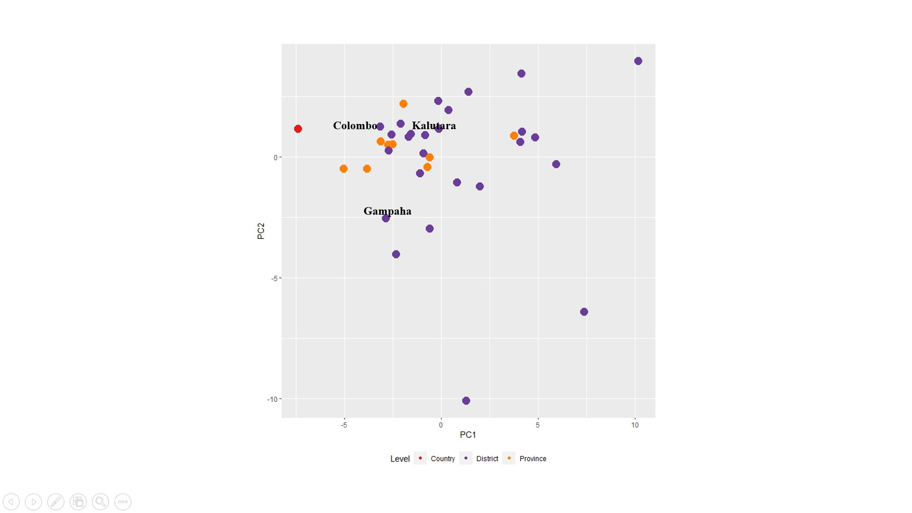
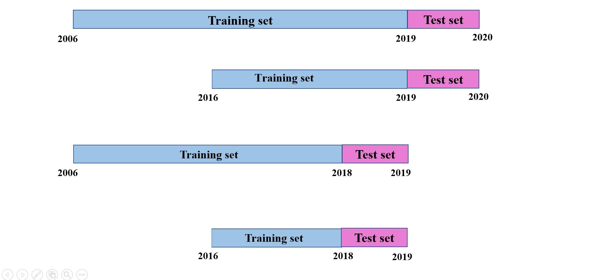

```{r setup, include=FALSE}
options(htmltools.dir.version = FALSE)
knitr::opts_chunk$set(
  fig.width=9, fig.height=3.5, fig.retina=3,
  out.width = "100%",
  cache = FALSE,
  echo = TRUE,
  message = FALSE, 
  warning = FALSE,
  fig.show = TRUE,
  hiline = TRUE
)
```

```{r xaringan-themer, include=FALSE, warning=FALSE}
library(xaringanthemer)
style_duo_accent(
  primary_color = "#053061",
  secondary_color = "#053061",
  inverse_header_color = "#FFFFFF"
)
```

class: inverse center middle

# Introduction


```{r ,echo=FALSE,fig.height=7,fig.width=16,out.width='100%',out.height='100%'}
#library(ggplot2)
#Year<-c(2010:2020)
#Dengue<-c(25559,21079,23792,22213,34775,23010,32695,174025,51938,92467,35397)
#df<-data.frame(Year,Dengue)
#S1<-ggplot(df, aes(x=as.factor(Year), y=Dengue, fill=Dengue)) + 
#  geom_bar(stat = "identity", color="#b2182b", fill="#b2182b")+ theme(legend.position = #'none')+
#  labs(x="Year", y = "Dengue counts")
#S1

```


---

# Objectives

### Main objective

* Forecast dengue incidence in Sri Lanka using Spatio-temporal structure of dengue incidence.

--

### Specific objectives

* Introduce a novel feature-based visualization approach to identify properties of time series. 

--

* Automate the process of reading PDF files.

---

class: inverse center middle

```{r figurechapter02, echo=FALSE, fig.align = 'center',message=FALSE, out.width = '100%', out.height = '100%',fig.height=5, fig.width=10}

```

---

# Data

* Epidemiological unit, Ministry of Health, Sri Lanka.

  *  https://www.epid.gov.lk/web/index.php?option=com_content&view=article&id=148&Itemid=449&lang=en

* Format of the table in the Epidemiological Report

```{r figurechapter03, echo=FALSE, fig.align = 'center',message=FALSE, out.width = '100%', out.height = '40%',fig.height=5, fig.width=10}

```

---

```{r ,echo=FALSE, fig.align = 'center',message=FALSE, out.width = '100%', out.height = '40%',fig.height=7, fig.width=10}

```

---

# PDF data extraction

.pull-left[
### Methods

* Copy and paste

* Manual data entry

* PDF table extraction tools
]

.pull-right[
### Challenges

* Cause errors

* Requires considerable amount of time and effort

* Doesn't maintain the original format

]

```{r , echo=FALSE, fig.align = 'center',message=FALSE}

```

---

# Reading PDF files

#### Reading_EpidemiologicalReports function

```{r }
#' path <- setwd(here::here("pdffiles","2020"))
#' startdate <- c("2019-12-21","2019-12-27","2019-12-28","2020-01-03","2020-01-04","2020-01-10","2020-01-11","2020-01-17","2020-01-18","2020-01-24","2020-01-25","2020-01-31","2020-02-01","2020-02-07","2020-02-08","2020-02-14","2020-02-15","2020-02-21","2020-02-22","2020-02-28","2020-02-29","2020-03-06","2020-03-07","2020-03-13","2020-03-14","2020-03-20","2020-03-21","2020-03-27","2020-03-28","2020-04-03","2020-04-04","2020-04-10","2020-04-11","2020-04-17","2020-04-18","2020-04-24","2020-04-25","2020-05-01","2020-05-02","2020-05-08","2020-05-09","2020-05-15","2020-05-16","2020-05-22","2020-05-23","2020-05-29","2020-05-30","2020-06-05","2020-06-06","2020-06-12","2020-06-13","2020-06-19","2020-06-20","2020-06-26","2020-06-27","2020-07-03","2020-07-04","2020-07-10","2020-07-11","2020-07-17","2020-07-18","2020-07-24","2020-07-25","2020-07-31","2020-08-01","2020-08-07","2020-08-08","2020-08-14","2020-08-15","2020-08-21","2020-08-22","2020-08-28","2020-08-29","2020-09-04","2020-09-05","2020-09-11","2020-09-12","2020-09-18","2020-09-19","2020-09-25","2020-09-26","2020-10-02","2020-10-03","2020-10-09","2020-10-10","2020-10-16","2020-10-17","2020-10-23","2020-10-24","2020-10-30","2020-10-31","2020-11-06","2020-11-07","2020-11-13","2020-11-14","2020-11-20","2020-11-21","2020-11-27","2020-11-28","2020-12-04","2020-12-05","2020-12-11","2020-12-12","2020-12-18")
#' year <- c(2019,2020,2020,2020,2020,2020,2020,2020,2020,2020,2020,2020,2020,2020,2020,2020,2020,2020,2020,2020,2020,2020,2020,2020,2020,2020,2020,2020,2020,2020,2020,2020,2020,2020,2020,2020,2020,2020,2020,2020,2020,2020,2020,2020,2020,2020,2020,2020,2020,2020,2020,2020)
#' week <- c(52,1,2,3,4,5,6,7,8,9,10,11,12,13,14,15,16,17,18,19,20,21,22,23,24,25,26,27,28,29,30,31,32,33,34,35,36,37,38,39,40,41,42,43,44,45,46,47,48,49,50,51);
#' Cname <- c("Division","Dengue","Dengue B","Dysentery","Dysentery B","Encephalitis",
#'        "Encephalitis B","Enteric Fever","Enteric Fever B","Food Poisioning",
#'        "Food Poisioning B","Leptospirosis","Leptospirosis B","Typhus Fever",
#'        "Typhus Fever B","Viral Hepatistis","Viral Hepatistis B","Human Rabies",
#'        "Human Rabies B","Chickenpox","Chickenpox B","Meningitis",
#'        "Meningitis B", "Leishmaniasis","Leishmaniasis B")
#' DeletingRows <- c(1,2,3,30,31,32,33,34)
#' TotalColmns <- 27
#' PercentageColmns <- c(26,27)
#' DeleteColmns <- c(3,5,7,9,11,13,15,17,19,21,23,25)
#' Weeks_2020 <- Reading_EpidemiologicalReports(path,startdate,year,week,Cname,DeletingRows,TotalColmns,PercentageColmns,DeleteColmns)

```

---

# Reading PDF files

```{r figurechapter07, echo=FALSE, fig.align = 'center',message=FALSE, out.width = '70%', out.height = '10%',fig.height=5, fig.width=10}
knitr::include_graphics("Figures/F7.JPG")
```

---

# Reading Excel files

```{r }
Processed_Data<-function(processed_data_path)
{
  Disease_Counts_csv <- list.files(path = ".", pattern = NULL, all.files = FALSE,
                                   full.names = FALSE, recursive = FALSE,
                                   ignore.case = FALSE, include.dirs = FALSE, no.. = FALSE)
  Data_Counts <- tsibble::as_tibble (data.table::rbindlist (lapply (Disease_Counts_csv , data.table::fread),fill = T))
  Data_Counts <- dplyr::relocate(Data_Counts, Year,Week,StartDate,EndDate,.before=Division)
  Data_Counts <- dplyr::arrange(Data_Counts, StartDate)
  setwd(here::here("data"))
  save (Data_Counts, file = 'FinalData.Rda')
  return(Data_Counts)
}
```

---

# DISC (DISease Counts) Package

```{r ,echo=FALSE}
library(tsibble)
library(magrittr)
library(forecast)
library(ggplot2)
library(tsibble)
library(feasts)
library(patchwork)
library(viridisLite)
library(viridis)

load("H:/ProgressPresentation/ProgressPresentation/data/FinalData.Rda")

D<-Data_Counts
D
```

---

class: inverse center middle

```{r , echo=FALSE, fig.align = 'center',message=FALSE, out.width = '100%', out.height = '100%',fig.height=5, fig.width=10,comment=NA}

```

---

# DISC (DISease Counts) Package


```{r figurechapter08, echo=FALSE, fig.align = 'center',message=FALSE, out.width = '25%', out.height = '25%',fig.height=6, fig.width=6}
knitr::include_graphics("Figures/F8M.JPG")
```

```{r}
#install.packages("remotes")
#remotes::install_github("SMART-Research/DISC")
```

---

class: inverse center middle

```{r ,echo=FALSE}
Week<-tsibble::yearweek(D$EndDate)
Date<-D$EndDate
Province<-rep(c(rep("Western",3),rep("Central",3),rep("Southern",3),rep("Nothern",5),
                rep("Eastern",3),rep("NorthWestern",2),rep("NorthCentral",2),
                rep("Uva",2),rep("Sabaragamuwa",2),rep("Eastern",1)),730)
Districts<-D$Division
Counts<-as.integer(D$Dengue)

```


```{r ,echo=FALSE}
DengueTEST<-tibble(Week,Date,Counts,Districts,Province)
DataDengueTEST<- DengueTEST%>% 
  as_tsibble(key=c(Province,Districts),index=Week)#<<

```


```{r figurechapter09, echo=FALSE, fig.align = 'center',message=FALSE, out.width = '100%', out.height = '100%',fig.height=5, fig.width=10}
knitr::include_graphics("Figures/F9.JPG")
```

---

class: inverse center middle

# Data Visualization

---

# Objectives of Data Visualization

* Identify the patterns associated with time series

* Dengue outbreak identification

* Prominent features identification

---

# Data Visualization

*   Time domain visualization

*   Feature based visualization

*   Change point analysis

---
# Time domain visualization-Districts

```{r ,echo=FALSE, code=readLines("PD.R"),echo=FALSE,results='hide',message=FALSE,warning=FALSE}
```


```{r figurechapter09A, echo=FALSE, fig.align = 'center',message=FALSE, out.width = '90%', out.height = '100%',fig.height=7, fig.width=14}

```

---
# Time domain visualization-Districts

```{r ,echo=FALSE, out.width = '90%', out.height = '40%',fig.height=5, fig.width=10, fig.align = 'center'}
Dengue_Districts <- DataDengueTEST%>%
  dplyr::group_by(Districts) %>%
  dplyr::summarise(Counts = sum(Counts))

cp<-Dengue_Districts%>%autoplot(Counts)+labs(y = "Counts",x="Week")
cp<-cp+theme(legend.position="bottom")
cp
```

---

# Time domain visualization-Districts


```{r ,echo=FALSE, out.width = '100%', out.height = '80%',fig.height=7, fig.width=16}
plotly::ggplotly(HM2)
```

---

# Min-Max Transformation

$$\frac{x_{i}-min(x)}{max(x)-min(x)}$$
where $x=(x_{1},x_{2},\dots,x_{n})$.

* Rescaling dengue counts of all districts onto 0-1 range.

---

# Time domain visualization-Districts


```{r ,echo=FALSE, out.width = '100%', out.height = '80%',fig.height=7, fig.width=16}
plotly::ggplotly(HMT2)
```

---

# Feature-based visualization

```{r figurechapter09FB, echo=FALSE, fig.align = 'center',message=FALSE, out.width = '100%', out.height = '100%',fig.height=9, fig.width=16}

```

---

# Time series features

* Feature of a time series is the numerical summary calculated from a time series.

### Seasonal and Trend (STL) Decomposition

```{r , echo=FALSE, fig.align = 'center',message=FALSE, out.width = '70%', out.height = '70%',fig.height=5, fig.width=10}
knitr::include_graphics("Figures/STL.JPG")
```

---

# Time series features

#### Strength of seasonality

$$F_{s}=max\biggl(0,1-\frac{Var(R_{t})}{Var(S_{t}+R_{t})}\biggr)$$
--

#### Strength of trend

$$F_{s}=max\biggl(0,1-\frac{Var(R_{t})}{Var(T_{t}+R_{t})}\biggr)$$
--

#### Spectral entropy

* A measure of forecastability of a time series.

$$H_{s}=-\int_{-\pi}^{\pi}\hat{f}_{y}(\lambda)log\hat{f}_{y}(\lambda).d\lambda$$
where $\hat{f}_{y}$ is an estimate of the spectral density of the data.

* Low value of $H_{s}$ implies that time series is easier to forecast.

---

# Time series features

#### Autocorrelation function: ACF

* Autocorrelation measures the strength of linear relationship between lagged value of a time series.

$$r_{k}=\frac{\sum_{t=k+1}^{T}(y_{t}-\bar{y})(y_{t-k}-\bar{y})}{\sum_{t=1}^{T}(y_{t}-\bar{y})^{2}}$$
$r_{k}$ measures the linear relationship between $y_{t}$ and $y_{t-k}$.

#### Number of crossing points

* computes the number of times a time series crosses the median.

---

# Spatial hierarchical structure

```{r figurechapter0004r1, echo=FALSE, fig.align = 'center',message=FALSE, out.width = '80%', out.height = '10%',fig.height=4, fig.width=10}
knitr::include_graphics("Figures/SPST.JPG")
```

---

# Time series features

```{r ,echo=FALSE}
SHS_DataDengueTEST<-DataDengueTEST%>%fabletools::aggregate_key(Province/Districts,Counts=sum(Counts))
```


```{r ,echo=FALSE,comment=NA}
Dengue_features<-SHS_DataDengueTEST %>% features(Counts, feature_set(pkgs = "feasts"))
Dengue_features
```

---

# Feature-based visualization

```{r figurechapter09FB2, echo=FALSE, fig.align = 'center',message=FALSE, out.width = '90%', out.height = '70%',fig.height=9, fig.width=16}
knitr::include_graphics("Figures/FES2.JPG")
```

---

# Principal Component Analysis

* Principal components are new variables that are constructed as linear combinations of the initial variables.

--

#### Standardization

$$Z=\frac{value-mean}{s.d.}$$

--

#### Covariance matrix computation

* For a 3 dimensional data set $x, y, z$,

$$
\begin{pmatrix}
Var(x) & Cov(x,y) & Cov(x, z)\\
Cov(y,x) & Var(y) & Cov(y, z)\\
Cov(z,x) & Cov(z,y) & Var(z)
\end{pmatrix}
$$

---

#### Compute Eigenvalues and Eigenvectors of covariance matrix

  * Rank the Eigenvalues in in descending order $\lambda_{1}>\lambda_{2}>\lambda_{3}$
  
  * Eigenvector that corresponds to the PC1 is $v_{1}$

--

#### Obtain Principal components

--

```{r ,echo=FALSE}
library(broom)
pr<-prcomp(Dengue_features[,-c(1,2,31,33,35,37)],scale=TRUE)
library(factoextra)
fviz_eig(pr)
```


---

# Principal Component Analysis

```{r ,echo=FALSE}

as.data.frame(pr$rotation)
```

```{r ,echo=FALSE}
pcs<-Dengue_features%>% dplyr::select(-c(1,2,31,33,35,37)) %>% prcomp(scale = TRUE) %>%
  augment(Dengue_features)
```

---

class: inverse center middle

# Feature-based visualization

---

```{r ,echo=FALSE, out.width = '100%', out.height = '100%',fig.height=9, fig.width=16}
knitr::include_graphics("Figures/PP1.JPG")
```

---

```{r ,echo=FALSE, out.width = '100%', out.height = '100%',fig.height=9, fig.width=16}
knitr::include_graphics("Figures/PP2.JPG")
```

---

```{r ,echo=FALSE, out.width = '100%', out.height = '100%',fig.height=9, fig.width=16}
knitr::include_graphics("Figures/PP3.JPG")
```

---

```{r ,echo=FALSE, out.width = '100%', out.height = '100%',fig.height=9, fig.width=16}

```

---

```{r ,echo=FALSE, out.width = '100%', out.height = '100%',fig.height=9, fig.width=16}
knitr::include_graphics("Figures/PP5.JPG")
```

---

```{r ,echo=FALSE, out.width = '100%', out.height = '100%',fig.height=9, fig.width=16}
knitr::include_graphics("Figures/PP6.JPG")
```

---

```{r ,echo=FALSE, out.width = '100%', out.height = '100%',fig.height=9, fig.width=16}

```

---

```{r ,echo=FALSE, out.width = '100%', out.height = '100%',fig.height=9, fig.width=16}
knitr::include_graphics("Figures/PP8.JPG")
```

---

```{r ,echo=FALSE, out.width = '100%', out.height = '100%',fig.height=9, fig.width=16}
knitr::include_graphics("Figures/PP9.JPG")
```

---

```{r ,echo=FALSE, out.width = '100%', out.height = '100%',fig.height=9, fig.width=16}
knitr::include_graphics("Figures/PP10.JPG")
```

---

```{r ,echo=FALSE, out.width = '100%', out.height = '100%',fig.height=9, fig.width=16}
knitr::include_graphics("Figures/PP11.JPG")
```

---

```{r ,echo=FALSE, out.width = '100%', out.height = '100%',fig.height=9, fig.width=16}
knitr::include_graphics("Figures/PP12.JPG")
```

---

```{r ,echo=FALSE, out.width = '100%', out.height = '100%',fig.height=9, fig.width=16}

```

---

```{r ,echo=FALSE, out.width = '100%', out.height = '100%',fig.height=9, fig.width=16}
knitr::include_graphics("Figures/PP14.JPG")
```

---

```{r ,echo=FALSE, out.width = '100%', out.height = '100%',fig.height=9, fig.width=16}

```

---

# Temporal hierarchical structure

```{r figurechapter0005V1, echo=FALSE, fig.align = 'center',message=FALSE, out.width = '100%', out.height = '5%',fig.height=5, fig.width=10}

```

---

# Temporal hierarchical structure

```{r figurechapter0005V2, echo=FALSE, fig.align = 'center',message=FALSE, out.width = '100%', out.height = '80%',fig.height=7, fig.width=14}
TEM
```

---

```{r ,echo=FALSE}
library(tsfeatures)
Temporal_DengueFeatures<-tsfeatures(aggts_total)
pr1<-prcomp(Temporal_DengueFeatures[,-c(1,10,11,12,20)],scale=TRUE)
as.data.frame(pr1$rotation)
```

---

# Principal Component Analysis

```{r ,echo=FALSE}
fviz_eig(pr1)
```

---

```{r ,echo=FALSE, out.width = '100%', out.height = '100%',fig.height=9, fig.width=16}

```

---

```{r ,echo=FALSE, out.width = '100%', out.height = '100%',fig.height=9, fig.width=16}
knitr::include_graphics("Figures/PP17.JPG")
```

---

# Change point analysis

* Change point detection is the process of identifying the time point, in which properties of data suddenly change.

.pull-left[
#### Changes in mean 

```{r ,echo=FALSE}
x=1:500
z=c(rnorm(100,1,sd=0.5),rnorm(150,0,sd=0.5),rnorm(200,2,sd=0.5),rnorm(50,0.5,sd=0.5))
plot(x,z,type='l',xlab='',ylab='',col='green')
lines(x=1:100,y=rep(1,100),col='red',lwd=3)
lines(x=101:250,y=rep(0,150),col='red',lwd=3)
lines(x=251:450,y=rep(2,200),col='red',lwd=3)
lines(x=451:500,y=rep(0.5,50),col='red',lwd=3)
```

]
.pull-right[
#### Changes in variance

```{r ,echo=FALSE}
x=1:500
z=c(rnorm(100,0,sd=0.1),rnorm(150,0,sd=0.7),rnorm(200,0,sd=0.25),rnorm(50,0,sd=1))
plot(x,z,type='l',xlab='',ylab='',col='green')
```

]

---

# Change point model for changes in mean

For data $z_{1}, z_{2},\dots, z_{n}$, if change points exist at $\tau_{1}, \tau_{2}, \dots, \tau_{k}$, then 

$$z_{t}=
    \begin{cases}
    \mu_{1} &   1\leq t \leq \tau_1 \\ 
    \mu_2 & \tau_1 < t \leq \tau_2 \\
    \vdots & \vdots \\
    \mu_{k+1} & \tau_k < t \leq \tau_{k+1}=n
    \end{cases}$$


---

```{r ,echo=FALSE, out.width = '100%', out.height = '100%',fig.height=9, fig.width=16}

```

---

```{r ,echo=FALSE, out.width = '100%', out.height = '100%',fig.height=9, fig.width=16}
knitr::include_graphics("Figures/PP19.JPG")
```

---

```{r ,echo=FALSE, out.width = '100%', out.height = '100%',fig.height=9, fig.width=16}
knitr::include_graphics("Figures/PP20.JPG")
```

---

```{r ,echo=FALSE, out.width = '100%', out.height = '100%',fig.height=9, fig.width=16}

```

---

class: inverse center middle

```{r figurechapter09N, echo=FALSE, fig.align = 'center',message=FALSE, out.width = '100%', out.height = '100%',fig.height=5, fig.width=10}
knitr::include_graphics("Figures/FL1.JPG")
```

---

class: inverse center middle

# Forecasting modeling

---

# Spatial hierarchical structure

```{r ,echo=FALSE, out.width = '85%', out.height = '10%',fig.height=4, fig.width=10,fig.align='center'}
knitr::include_graphics("Figures/SPST.JPG")
```

---

# Spatial hierarchical forecasting workflow

* All series at all levels of the hierarchical structure individually forecast based on **Mean, NAIVE, SNAIVE, ETS, and ARIMA methods**.

* These are referred to as **base forecasts**.

```{r , echo=FALSE, fig.align = 'center',message=FALSE}

```

---

# Coherence of data

```{r , echo=FALSE, fig.align = 'center',message=FALSE}

```

---

# Base forecasting approaches

### Mean method

* Forecasts of all future values are equal to the average of the historical data.

* If historical data are $y_{1}, y_{2},\dots, y_{T}$, then  

$$\hat{y}_{T+h|T}=\frac{y_{1}+y_{2}+\dots + y_{T}}{T}$$

### NAIVE method

* All forecasts are equal to the value of the last observation.

* If historical data are $y_{1}, y_{2},\dots, y_{T}$, then  

$$\hat{y}_{T+h|T}=y_{T}$$
---

# Base forecasting approaches

### SNAIVE method

* Forecast to be equal to the last observed value from the same season of the year.

* If historical data are $y_{1}, y_{2},\dots, y_{T}$, then  

$$\hat{y}_{T+h|T}=y_{T+h-m(k+1)}$$

* $m=$ seasonal period
* $k=$ number of completed years in the forecast period prior to time $T+h$.  

### Exponential Smoothing (ETS) models

* Forecasts are produced based on weighted averages of the past observations.

$$\hat{y}_{T+1|T}=\alpha y_{T}+(1-\alpha)\hat{y}_{T}$$
$\hat{y}_{T+1|T}=\alpha y_{T}+\alpha (1-\alpha)y_{T-1}+\alpha (1-\alpha)^{2}y_{T-2}+\alpha (1-\alpha)^{3}y_{T-3}+\dots$

---

# Base forecasting approaches

### AutoRegressive Integrated Moving Average (ARIMA) models

* ARIMA models aim to describe the autocorrelations in the data.

#### Autoregressive models

Autoregressive models consist the variable of interest using a linear combination of past values of the variable.

$$y_{t}=\phi_{0}+\phi_{1}y_{t-1}+\phi_{2}y_{t-2}+\dots+\phi_{p}y_{t-p}+\epsilon_{t}$$
#### Moving average models

In moving average models, current variable of interest is a linear combination of past forecast errors and current error.

$$y_{t}=\phi_{0}+\theta_{1}\epsilon_{t-1}+\theta_{2}\epsilon_{t-2}+\dots+\theta_{q}\epsilon_{t-q}+\epsilon_{t}$$

---

```{r ,echo=FALSE, out.width = '100%', out.height = '100%',fig.height=9, fig.width=16}

```

---

```{r ,echo=FALSE, out.width = '100%', out.height = '100%',fig.height=9, fig.width=16}

```

---

# Forecast Reconciliation

#### $h$ step ahead reconciled forecasts at time $t: \hspace{0.1in} \tilde{y}_{t}{(h)}$ 

#### $h$ step ahead base forecasts at time $t: \hspace{0.1in} \hat{y}_{t}{(h)}$ 

```{r , echo=FALSE, fig.align = 'center',message=FALSE, out.width = '40%', out.height = '40%'}
knitr::include_graphics("Figures/AUTO2.JPG")
```

* Role of $G$ is different from approach to approach.

---

# Top down approach

```{r , echo=FALSE, fig.align = 'center',message=FALSE, out.width = '50%', out.height = '50%'}

```

$$
G=
\begin{pmatrix}
p_{1} & 0 & 0 & 0 & 0 & 0 & 0\\
p_{2} & 0 & 0 & 0 & 0 & 0 & 0\\
p_{3} & 0 & 0 & 0 & 0 & 0 & 0\\
p_{4} & 0 & 0 & 0 & 0 & 0 & 0
\end{pmatrix}
$$

---

# Bottom up approach

```{r , echo=FALSE, fig.align = 'center',message=FALSE, out.width = '50%', out.height = '50%'}
knitr::include_graphics("Figures/BU.JPG")
```

$$
G=
\begin{pmatrix}
0 & 0 & 0 & 1 & 0 & 0 & 0\\
0 & 0 & 0 & 0 & 1 & 0 & 0\\
0 & 0 & 0 & 0 & 0 & 1 & 0\\
0 & 0 & 0 & 0 & 0 & 0 & 1
\end{pmatrix}
$$
---

# Trace minimization approach (MinT)

$$G=(S^{'}W_{h}^{-1}S)^{-1} S^{'}W_{h}^{-1}$$

* Error variance of base forecasts

$$Var(y_{t+h}- \hat{y}_{t}(h))=W_{h}$$
#### Alternatives for $W_{h}$

* Ordinary least square estimator

#### $$W_{h}=k_{h}I$$

* Weighted least square estimator using structure of hierarchy

#### $$W_{h}=k_{h} \Lambda$$

* Weighted least square estimator using shrinkage estimator

#### $$W_{h}=k_{h} \hat{W}_{1,D}^{*}$$

---

# Forecast accuracy

* Performance of a forecast model is evaluated base on forecast accuracy.

### Mean Absolute Scale Error (MASE)

* Error is the difference between observed value and forecast  $(e_{T+h}=y_{T+h}-\hat{y}_{T+h|T})$.

$$MASE=mean(|q_{j}|)$$
where $$q_{j}=\frac{e_{j}}{\sum_{t=m+1}^{T}\frac{|y_{t}-y_{t-m}|}{T-m}}$$

---

# Spatial hierarchical forecasting

```{r ,echo=FALSE, out.width = '100%', out.height = '90%',fig.height=8, fig.width=16,fig.align='center'}

```

---

```{r ,echo=FALSE, out.width = '100%', out.height = '100%',fig.height=9, fig.width=16}

```

---

# The best forecasting approaches in districts

```{r ,echo=FALSE, out.width = '48%', out.height = '17%',fig.height=7, fig.width=14,fig.align='center'}

```

---

# The best forecasting approaches in provinces

```{r ,echo=FALSE, out.width = '48%', out.height = '17%',fig.height=7, fig.width=14,fig.align='center'}

```

---

# The best approach for forecasts in 2020 

```{r ,echo=FALSE, out.width = '42%', out.height = '10%',fig.height=7, fig.width=14,fig.align='center'}
knitr::include_graphics("Figures/MAP3.JPG")
```

---

# Temporal hierarchical structure

```{r figurechapter0005, echo=FALSE, fig.align = 'center',message=FALSE, out.width = '100%', out.height = '5%',fig.height=5, fig.width=10}

```

---

#  The best forecasting approaches for temporal granualities

```{r ,echo=FALSE, fig.align = 'center',message=FALSE, out.width = '100%', out.height = '50%',fig.height=8, fig.width=10}

```

---
class: center, middle

# Thank you!

Slides created via the R packages:

[**xaringan**](https://github.com/yihui/xaringan)<br>
[gadenbuie/xaringanthemer](https://github.com/gadenbuie/xaringanthemer)

The chakra comes from [remark.js](https://remarkjs.com), [**knitr**](http://yihui.name/knitr), and [R Markdown](https://rmarkdown.rstudio.com).

---

* Pruned Exact Linear Time (PELT) method (Killick et al. (2012))

\begin{align}
\sum_{i=1}^{k+1}{\left[\mathcal{C}(z_{(\tau_{i-1}+1):\tau_i})\right] + \lambda f(k)}
\end{align}

* This function depends on the data just through a sum of a *cost* for each segment.  

* Penalty term that depends on the number of change points.

---